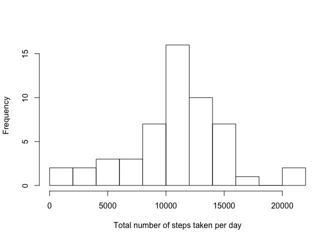
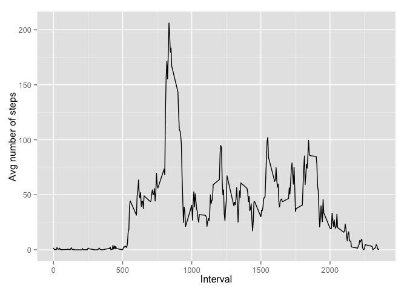
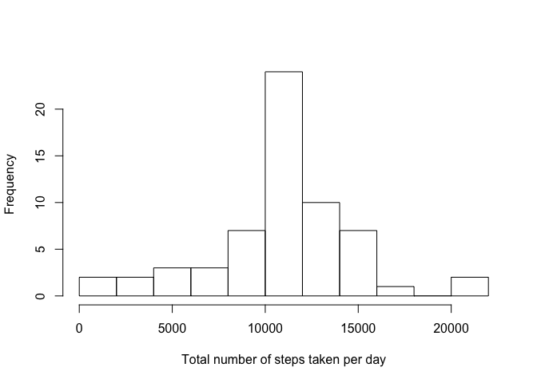
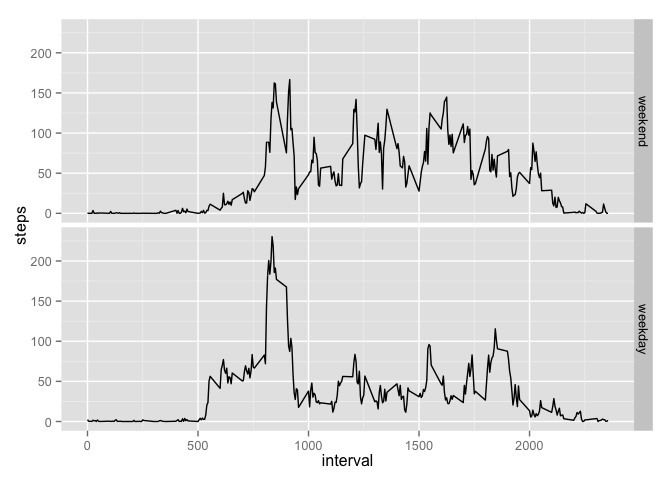

# Reproducible Research: Peer Assessment 1


## Loading and preprocessing the data


```r
#load data and necessary libraries
library(dplyr)
```

```
## 
## Attaching package: 'dplyr'
## 
## The following object is masked from 'package:stats':
## 
##     filter
## 
## The following objects are masked from 'package:base':
## 
##     intersect, setdiff, setequal, union
```

```r
library(ggplot2)
AcData <- read.csv("activity.csv", na.strings="NA")
```

## What is mean total number of steps taken per day?


```r
#total number of steps per day:
T_steps <- aggregate(steps ~ date, data=AcData, FUN=sum) 
#histrogram of total number of steps per day:
hist(T_steps$steps,  xlab="Total number of steps taken per day", main="", breaks=10)
```

 

```r
#output summary
summary(T_steps$steps)
```

```
##       Min.    1st Qu.     Median       Mean    3rd Qu.       Max. 
##    41.0000  8841.0000 10765.0000 10766.1887 13294.0000 21194.0000
```

The mean of the total number of steps per day is : 10766.1886792453

The median of the total number of steps per day is : 10765

## What is the average daily activity pattern?


```r
#calculate the mean number of steps taken per interval
step_int <- aggregate(steps ~ interval, data=AcData, FUN=mean)
#time series plot of the 5-minute interval (x-axis) and the average number of steps taken, averaged across all days (y-axis)
qplot(step_int$interval,step_int$steps, geom="path",xlab="Interval",ylab="Avg number of steps")
```

 

```r
summary(step_int$steps)
```

```
##         Min.      1st Qu.       Median         Mean      3rd Qu. 
##   0.00000000   2.48584906  34.11320750  37.38259960  52.83490570 
##         Max. 
## 206.16981100
```

The 5-minute interval containing the maximum number of steps, averaged across all days in the data set is: 835. The maximun number of averaged steps is: 206.169811320755.

## Imputing missing values


```r
MV <- sum(is.na(AcData$steps))
```

The number of missing values is: 2304.

We replace all the missing values with the mean for that 5-minute interval:


```r
head(AcData)
```

```
##   steps       date interval
## 1    NA 2012-10-01        0
## 2    NA 2012-10-01        5
## 3    NA 2012-10-01       10
## 4    NA 2012-10-01       15
## 5    NA 2012-10-01       20
## 6    NA 2012-10-01       25
```

```r
intmeans <- rep(step_int$steps, 61)
#create a new data set with missing values filled in:
AcData_new <- mutate(AcData, steps = replace(AcData$steps, is.na(AcData$steps),intmeans[is.na(AcData$steps)]))
head(AcData_new)
```

```
##             steps       date interval
## 1 1.7169811320755 2012-10-01        0
## 2 0.3396226415094 2012-10-01        5
## 3 0.1320754716981 2012-10-01       10
## 4 0.1509433962264 2012-10-01       15
## 5 0.0754716981132 2012-10-01       20
## 6 2.0943396226415 2012-10-01       25
```

```r
#total number of steps per day in new data set:
T_steps_new <- aggregate(steps ~ date, data=AcData_new, FUN=sum) 
#histrogram of total number of steps per day:
hist(T_steps_new$steps,  xlab="Total number of steps taken per day", main="", breaks=10)
```

 

```r
#output summary
summary(T_steps_new$steps)
```

```
##       Min.    1st Qu.     Median       Mean    3rd Qu.       Max. 
##    41.0000  9819.0000 10766.1887 10766.1887 12811.0000 21194.0000
```

The mean of the total number of steps per day is : 10766.1886792453

The median of the total number of steps per day is : 10766.1886792453

Imputing missing values using the approach described above does not change the mean values, however it does slightly alter the median value by: 0.011042073807 %.


## Are there differences in activity patterns between weekdays and weekends?


```r
#modify date format in data set with filled-in missing values
AcData_new$date <- as.character(AcData_new$date)
AcData_new$date <- as.Date(AcData_new$date)
#add new variable for weekday name:
AcData_new <- mutate(AcData_new, weekday=weekdays(AcData_new$date, abbreviate=FALSE))
#create factor variable: day, indicating weekend or weekday
AcData_new$day <- ifelse(AcData_new$weekday %in% c("Saturday", "Sunday"), "weekend", "weekday")
AcData_new$day <- as.factor(AcData_new$day)
str(AcData_new)
```

```
## 'data.frame':	17568 obs. of  5 variables:
##  $ steps   : num  1.717 0.3396 0.1321 0.1509 0.0755 ...
##  $ date    : Date, format: "2012-10-01" "2012-10-01" ...
##  $ interval: int  0 5 10 15 20 25 30 35 40 45 ...
##  $ weekday : chr  "Monday" "Monday" "Monday" "Monday" ...
##  $ day     : Factor w/ 2 levels "weekday","weekend": 1 1 1 1 1 1 1 1 1 1 ...
```

```r
#calculate mean steps per int: weekday & weekend
step_int_weekday <- aggregate(steps ~ interval + day, data=AcData_new, FUN=mean) 
#plot:
g <- ggplot(step_int_weekday, aes(interval,steps))
g + geom_line() + facet_grid(day ~ ., as.table=FALSE)
```

 

